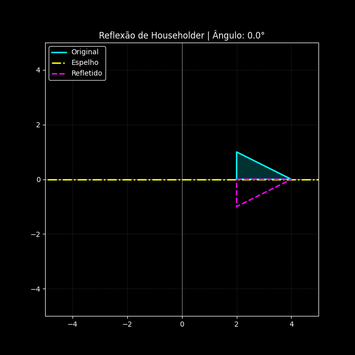

# 🪞 Visualização de Reflexão Householder em 2D


> Uma implementação visual para a disciplina de Álgebra Linear, demonstrando transformações geométricas em tempo real.

---

## 🖼️ Demonstração Visual



*(O polígono em **Magenta** é o reflexo exato do original em **Ciano**, espelhado pela linha **Amarela**)*

> **Nota:** O GIF acima pode apresentar uma velocidade de transição ligeiramente acelerada em relação à execução em tempo real do script, devido às limitações de *frame rate* do formato de imagem.

---

## 📄 Sobre o Projeto

Este projeto foi desenvolvido no curso de **Engenharia de Software** da **Universidade Federal do Ceará (Campus Russas)**.

O objetivo principal é desmistificar o conceito de **Transformações Lineares**, utilizando a programação para visualizar como a álgebra matricial atua no espaço geométrico $R^2$. O script gera uma animação contínua onde um vetor normal rotaciona 360º, atualizando a matriz de reflexão a cada quadro.

---

## 🧮 Fundamentação Matemática

A mágica acontece através da **Matriz de Householder**. Diferente de abordagens que exigem calcular ângulos para cada ponto, Householder utiliza um vetor normal unitário para espelhar todo o espaço.

A transformação de um ponto $\vec{x}$ é dada por:

$$\vec{x}_{refletido} = H \cdot \vec{x}_{original}$$

Onde $H$ é a matriz definida por:

$$H = I - 2vv^T$$

* $I$: Matriz Identidade.
* $v$: Vetor unitário normal (perpendicular) à reta de reflexão.

> **Implementação:** O código utiliza a biblioteca `NumPy` para vetorizar essa operação, calculando a reflexão de todos os vértices do polígono simultaneamente, sem o uso de laços de repetição (`loops`) lentos.

---

## 🚀 Tecnologias Utilizadas

* **[Python 3](https://www.python.org/)**: Linguagem base.
* **[NumPy](https://numpy.org/)**: Para cálculos de álgebra linear (produto matricial `@`, transposição `.T`).
* **[Matplotlib](https://matplotlib.org/)**: Para renderização gráfica e animação (`FuncAnimation`).
* **[Pillow](https://python-pillow.org/)**: Para exportação do resultado visual em `.gif`.

---

## 📦 Como Rodar Localmente

Certifique-se de ter o Python instalado em sua máquina.

1.  **Clone este repositório:**
    ```bash
    git clone [https://github.com/SEU-USUARIO/reflexao-householder-2d.git](https://github.com/SEU-USUARIO/reflexao-householder-2d.git)
    cd reflexao-householder-2d
    ```

2.  **Instale as dependências necessárias:**
    ```bash
    pip install numpy matplotlib pillow
    ```

3.  **Execute o script:**
    ```bash
    python reflexao.py
    ```

✅ O arquivo `reflexao_householder.gif` será gerado automaticamente na pasta do projeto.

---

## 👥 Autores

Trabalho desenvolvido pela equipe:

* **Álvaro Antônio Medeiros Ibiapina Coelho**
* **Felipi Ribeiro dos Santos**
* **Francisco Rian Maia Almeida**
* **José Natanael Monteiro Gomes**
* **Pedro Gabriel Quadros de Jesus**

🎓 **Orientador:** Prof. Anderson Feitoza

---

*Feito com 🐍 e Álgebra Linear.*
